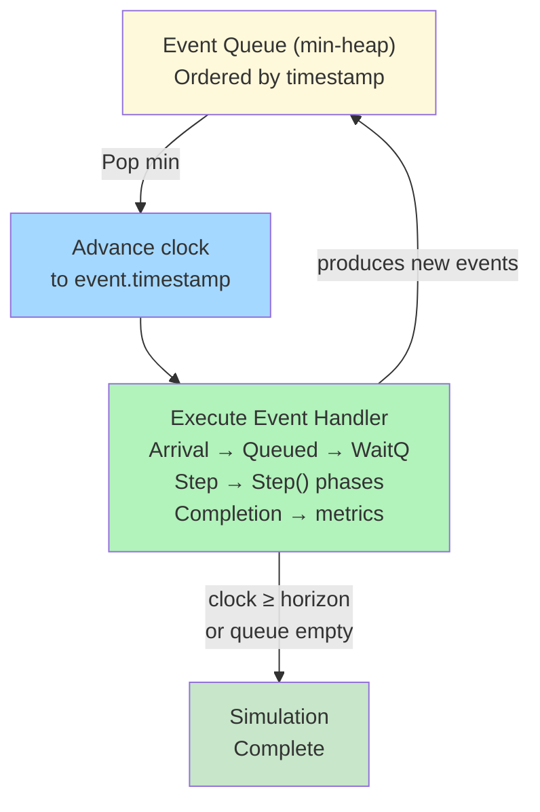
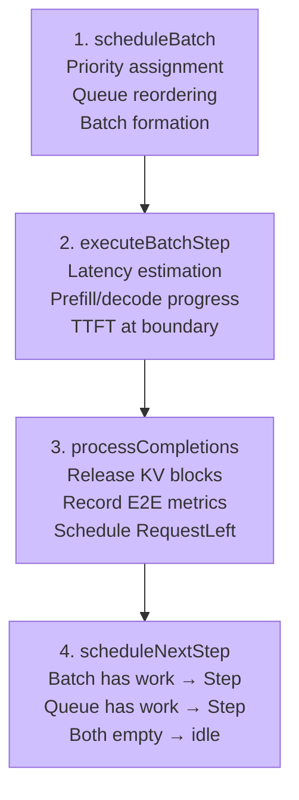
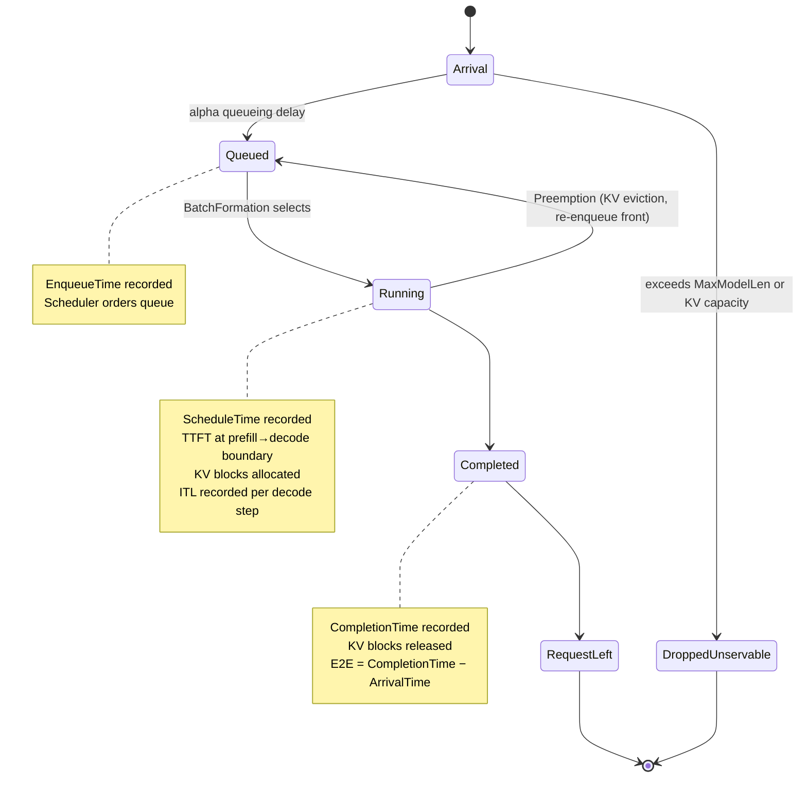

# Core Engine

This page describes BLIS's single-instance discrete event simulation engine. For multi-instance cluster orchestration, see [Cluster Architecture](architecture.md).

> **Canonical sources:** System invariants (INV-1 through INV-9) are defined in [`docs/contributing/standards/invariants.md`](../contributing/standards/invariants.md). If invariant descriptions here diverge, `invariants.md` is authoritative.

## Overview

Each BLIS instance is a self-contained discrete event simulator. The engine maintains an event queue (min-heap), processes events in timestamp order, and advances a simulation clock. The core loop is:

```
while events remain and clock < horizon:
    event = pop earliest event from queue
    advance clock to event.timestamp
    execute event (may produce new events)
```

The engine models the full vLLM inference pipeline: request arrival, queueing, batch formation, step execution, KV cache management, and latency estimation — all without real GPU hardware.

## Event Queue

The event queue is a min-heap ordered by event timestamp. Events represent state transitions in the simulation:

| Event Type | Trigger | Effect |
|------------|---------|--------|
| `ArrivalEvent` | Request enters system | Computes queueing delay (alpha overhead), schedules `QueuedEvent` |
| `QueuedEvent` | Request enters wait queue | Adds request to wait queue; if no `StepEvent` exists, schedules one (work-conserving) |
| `StepEvent` | Batch ready for execution | Runs the 4-phase Step() cycle (see below) |
| `ScheduledEvent` | Request moves to running batch | Timeline marker for tracing (scheduling delay recorded in `scheduleBatch`) |
| `RequestLeftEvent` | Request completes | Timeline marker for tracing (E2E metrics recorded in `processCompletions`) |

**Clock monotonicity (INV-3):** The simulation clock never decreases. Events are processed in strictly non-decreasing timestamp order.

**Work-conserving (INV-8):** After every step completion, if the wait queue is non-empty, a `StepEvent` must exist in the event queue. The simulator never idles while work is waiting.



## Step Phases

The `Step()` function is a 4-line orchestrator that delegates to four phases:



### Phase 1: Schedule Batch (`scheduleBatch`)

1. Assign priority scores to all queued requests via the priority policy
2. Reorder the wait queue via the scheduling policy (e.g., FCFS, SJF, priority-based)
3. Invoke batch formation to select which requests enter the running batch
4. Record preemption metrics for any evicted requests
5. Schedule `ScheduledEvent` for any newly admitted requests

### Phase 2: Execute Batch Step (`executeBatchStep`)

1. Compute step time via the latency model based on batch composition
2. For each request in the batch:
   - If in prefill phase: advance the progress index through input tokens (respecting chunked prefill limits)
   - If in decode phase: advance the progress index by one output token
   - Record TTFT at the prefill-to-decode boundary
3. Return the computed step time to Phase 4 for scheduling the next `StepEvent` (the clock itself advances only at the event-loop level when the next event is popped)

### Phase 3: Process Completions (`processCompletions`)

Identify completed requests (all output tokens generated), release their KV blocks, record E2E metrics, and schedule `RequestLeftEvent`. Note: TTFT is already recorded in Phase 2 at the prefill-to-decode boundary, so Phase 3 only handles E2E and completion bookkeeping. This separation (TTFT in Phase 2, E2E in Phase 3) is the "two-pass" design that ensures TTFT is recorded before E2E.

### Phase 4: Schedule Next Step (`scheduleNextStep`)

1. If the running batch still has requests, schedule the next `StepEvent` at `now + stepTime`
2. If the running batch is empty but the wait queue has requests, schedule the next `StepEvent` at `now + stepTime` (work-conserving)
3. If both are empty, do nothing (next event will be a future arrival)

## Request Lifecycle

Requests follow a linear state machine with one exception (preemption):



> **INV-5 (Causality):** ArrivalTime ≤ EnqueueTime ≤ ScheduleTime ≤ CompletionTime

### States

| State | Description |
|-------|-------------|
| **Queued** | In wait queue, not yet in running batch. Ordered by scheduling policy. |
| **Running** | In running batch, actively being processed. Progressing through prefill or decode. |
| **Completed** | All output tokens generated. KV blocks released. Metrics recorded. |

### Key Timestamps

These are the conceptual timestamps in a request's lifecycle. Some are stored as struct fields (e.g., `ArrivalTime`, `FirstTokenTime`), while others are computed at metric recording time.

| Timestamp | When Recorded | Used For |
|-----------|---------------|----------|
| Arrival time | Request creation | E2E and scheduling delay baseline |
| Enqueue time | After alpha queueing delay | Conceptual start of wait queue residence |
| Schedule time | Batch formation selects request | Scheduling delay = time in wait queue |
| First token time | End of prefill phase | TTFT = FirstTokenTime (stored on Request) |
| Completion time | All tokens generated | E2E = FirstTokenTime + sum(ITLs) |

**Causality invariant (INV-5):** `arrival_time <= enqueue_time <= schedule_time <= completion_time`

### Preemption

When KV cache pressure forces eviction, running requests are preempted:
1. Request is removed from the running batch (tail-first eviction)
2. Its KV blocks are freed
3. It is re-enqueued at the front of the wait queue (not the back)
4. A debug log is emitted and `PreemptionCount` is incremented

Preempted requests reset to the beginning of prefill (ProgressIndex = 0) and their KV blocks are freed. However, the freed blocks' prefix hashes are preserved in the KV cache's free list — when the request is re-scheduled, prefix caching may find these blocks (if not yet evicted by LRU), reducing recomputation. This matches vLLM's "recompute" preemption mode.

### Dropped Requests

Requests are dropped as unservable at enqueue time (incrementing `DroppedUnservable`) via two guards:

1. **MaxModelLen guard** — when `--max-model-len` is set, requests whose total sequence length exceeds the context window are rejected. A preprocessing step auto-fills `MaxOutputLen = maxModelLen - len(InputTokens)` when the client doesn't set a budget (`MaxOutputLen == 0`), mirroring vLLM's `input_processor.py:554`. The guard then checks `input + MaxOutputLen > maxModelLen`. Workload generators set `MaxOutputLen = len(OutputTokens)` (tight budget); the auto-fill is a safety net for requests that bypass generators.
2. **KV capacity guard** — requests whose input tokens require more KV blocks than the total cache capacity are rejected. This prevents livelock where the simulator would endlessly preempt and re-enqueue a request that can never fit.

Both guards fire before the request enters the wait queue, mirroring vLLM's pre-engine rejection. Additionally, when `--max-model-len` is set, a runtime length cap force-completes any request whose `ProgressIndex` reaches `MaxModelLen` during decode (defense-in-depth).

## Batch Formation

BLIS models vLLM's continuous batching algorithm through the `VLLMBatchFormation` implementation.

### Two-Phase Algorithm

**Phase 1: Continuing Requests**
Process requests already in the running batch:
- Apply chunked prefill limits (`--long-prefill-token-threshold`)
- Allocate token budget for decode tokens
- If KV allocation fails for a continuing request, preempt requests from the batch tail to free blocks

**Phase 2: New Requests**
Dequeue requests from the wait queue:
- Compute cached prefix blocks (prefix caching reduces allocation needs)
- Allocate KV blocks for uncached prefix tokens being processed this step (bounded by chunked prefill threshold and remaining token budget)
- Stop dequeuing when: max batch size reached (`--max-num-running-reqs`), allocation fails (cache full), token budget exhausted, or a preemption occurred during Phase 1

### Constraints

| Constraint | Flag | Effect |
|------------|------|--------|
| Max batch size | `--max-num-running-reqs` | Limits number of concurrent requests in the running batch |
| Token budget | `--max-num-scheduled-tokens` | Limits total new tokens across all running requests per step |
| Chunked prefill | `--long-prefill-token-threshold` | Splits long prefills across multiple steps |

### Preemption Strategy

When KV allocation fails for a continuing request:
1. Evict requests from the batch tail (reverse order of admission)
2. Free their KV blocks
3. Re-enqueue evicted requests at the front of the wait queue
4. Retry allocation for the original request
5. **Circuit breaker:** Stop if allocation still fails after exhausting the batch, or if the request itself is unservable

## KV Cache Management

The KV cache simulates GPU memory organized as fixed-size blocks. Each block holds `--block-size-in-tokens` tokens (default: 16).

### Single-Tier Cache

The default KV cache operates entirely in GPU memory:

- **Block allocation:** Requests are allocated blocks proportional to their token count
- **Prefix caching:** Hierarchical block hashing enables prefix sharing across requests. Each block's hash chains with the prior block's hash, creating semantic prefix signatures. When a new request shares a prefix with an existing request, the cached blocks are reused rather than reallocated.
- **LRU eviction:** Free blocks are managed via a doubly-linked list with LRU ordering
- **Reference counting:** Shared blocks (prefix caching) are reference-counted and exempt from eviction while any request references them
- **Transactional allocation:** Multi-block allocations are rolled back on failure (no partial allocation)

**Conservation invariant (INV-4):** `allocated_blocks + free_blocks = total_blocks` at all times.

### Tiered Cache (GPU + CPU)

When `--kv-cpu-blocks` is set to a positive value, BLIS enables a two-tier cache:

- **GPU tier:** Full KV cache with prefix caching and LRU eviction
- **CPU tier:** Simple capacity store for offloaded blocks
- **Offload trigger:** When GPU utilization exceeds `--kv-offload-threshold` (default: 0.9), blocks are offloaded to CPU
- **Reload:** On GPU allocation failure, blocks are reloaded from CPU with a transfer latency penalty
- **Transfer latency:** Per reloaded block: `base_latency + ceil(block_size_tokens / bandwidth)`. Accumulated across all reloaded blocks. Non-blocking (added to step time).
- **Thrashing detection:** Blocks offloaded and reloaded within 1000 ticks (1ms) increment a thrashing counter

## Latency Models

BLIS predicts GPU step time through one of four latency model backends. The choice is made via the `--latency-model` flag or automatically based on available configuration.

### Blackbox Model (Default)

Uses trained regression coefficients to predict step time:

```
StepTime    = beta0 + beta1 * cache_miss_tokens + beta2 * decode_tokens
QueueingTime = alpha0 + alpha1 * input_length
OutputTokenProcessingTime = alpha2
```

- **Beta coefficients** model GPU execution time as a linear function of batch composition
- **Alpha coefficients** model non-GPU overhead (tokenization, API serialization, output processing)
- Coefficients are trained offline via Bayesian optimization against real vLLM measurements
- Pre-trained coefficients for common model/GPU combinations are shipped in `defaults.yaml`

See [Configuration Reference: Coefficient Calibration](../reference/configuration.md#coefficient-calibration) for the training process.

### Roofline Model (Analytical)

Uses analytical FLOPs/bandwidth estimation when no trained coefficients are available:

```
Phase Time = max(total_FLOPs / peak_compute, total_bytes / peak_bandwidth)
Step Time  = Prefill Phase Time + Decode Phase Time
```

- Requires HuggingFace `config.json` (model architecture: layers, heads, hidden dim)
- Requires `hardware_config.json` (GPU specs: peak TFLOPS, peak bandwidth, MFU)
- Accounts for Tensor Parallelism, All-Reduce latency, and per-layer overheads
- No training data needed — works for any supported model immediately

See [Roofline Estimation](roofline.md) for implementation details.

### Alpha Overhead

Alpha overhead models non-GPU processing time:
- **Queueing time** (`alpha0 + alpha1 * input_length`): Delays request enqueue but does not block the server. The simulation clock is not advanced by this overhead.
- **Output token processing time** (`alpha2`): Added to per-request ITL/TTFT metrics but does not block the next step.

This is architecturally correct for vLLM, where CPU post-processing (tokenization, output serialization) runs concurrently with GPU execution.

## Scheduling Policies

Scheduling policies control the order in which queued requests are selected for batch formation. They operate per-instance. To add a new scheduling policy, see [Extension Recipes](../contributing/extension-recipes.md).

| Policy | Ordering Rule | Use Case |
|--------|---------------|----------|
| `fcfs` | No reordering (arrival order) | Default, fair |
| `priority-fcfs` | Priority descending, then arrival ascending | SLO-aware scheduling |
| `sjf` | Input token count ascending, then arrival ascending | Shortest-job-first for TTFT optimization |
| `reverse-priority` | Priority ascending (starves high-priority) | Pathological testing only |

### Priority Policies

Priority policies assign a numeric score to each request before scheduling:

| Policy | Score Computation | Behavior |
|--------|-------------------|----------|
| `constant` | Fixed score for all requests | No differentiation (default) |
| `slo-based` | `base + age_weight * (clock - arrival)` | Favors older requests, prevents starvation. Note: despite the name, does not currently use per-request SLO metadata. |
| `inverted-slo` | `base - age_weight * age` | Starves older requests (pathological) |

## Metrics

BLIS records per-request and aggregate metrics throughout the simulation.

### Per-Request Metrics

| Metric | Definition |
|--------|------------|
| **TTFT** | Time from arrival to first token: includes queueing delay, prefill step times, and output processing overhead (alpha2) |
| **E2E** | `FirstTokenTime + sum(ITLs)`, where each ITL includes step time + alpha2 |
| **ITL** | Observed time between consecutive decode steps (includes alpha2 per token) |
| **Scheduling Delay** | Time from request arrival to entering the running batch (includes alpha queueing overhead + wait queue residence) |

### Aggregate Metrics

| Metric | Aggregation |
|--------|-------------|
| TTFT, E2E, ITL distributions | Mean, p90, p95, p99 in JSON output. Cluster-internal `Distribution` type also computes p50, min, max for fitness evaluation. |
| Throughput | Output tokens per second, requests per second |
| Preemption count | Total KV cache evictions |
| KV allocation failures | Failed block allocations |
| Dropped unservable | Requests too large for cache |

### Conservation Invariant (INV-1)

At simulation end: `injected_requests == completed_requests + still_queued + still_running + dropped_unservable`

This is the fundamental accounting invariant that ensures no requests are silently lost.

## Determinism

BLIS guarantees deterministic output: the same seed produces byte-identical stdout across runs (INV-6).

Key mechanisms:
- **Partitioned RNG:** Each subsystem (workload generation, scheduling, etc.) uses an independent random stream derived from the seed, so adding randomness to one subsystem doesn't perturb others
- **Sorted map iteration:** Where map iteration order affects output, keys are sorted first
- **Stdout/stderr separation:** Deterministic results go to stdout; wall-clock timing and diagnostics go to stderr via logrus
